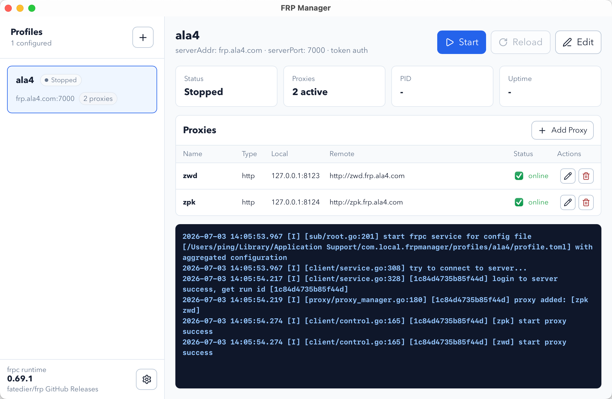

# FRP Manager

Languages: [简体中文](#简体中文) | [English](#english)



## 简体中文

FRP Manager 是一个用于管理 `frp` 本地客户端 `frpc` 的桌面管理软件。它不是新的内网穿透协议，也不是 `frps` 服务端；它做的是把日常使用 `frpc` 时最繁琐的 profile、proxy、runtime、进程和日志管理收进一个桌面应用里。

如果你已经在用 `frp`，但经常需要手动编辑 TOML、打开终端启动 `frpc`、反复确认某个映射是否在线，FRP Manager 就是为这个场景准备的。

### 解决的痛点

- 不再每次手动改 `frpc.toml`：Profile 和 Proxy 都可以通过表单创建、编辑和删除。
- 不再记启动命令：在主窗口或托盘菜单里启动、停止、重载 Profile。
- 不再靠猜进程状态：界面会显示运行状态、PID、在线映射数量和运行时间。
- 不再为了开关一个映射改配置重启：Proxy 可以单独启用、停用，运行中的 Profile 会按需 reload。
- 不再手动下载不同平台的 `frpc`：应用会根据当前系统下载对应的 runtime，并记录本地版本。
- 不再到处找日志：`frpc` 输出会直接显示在主界面日志面板里，并保留原生颜色。
- 不再只能盯着主窗口：菜单栏 / 托盘可以快速启动停止 Profile、切换 Proxy、显示窗口或退出应用。

### 主要功能

- 多 Profile 管理：适合维护不同 frps 服务端或不同环境的配置。
- Profile 表单：支持 `serverAddr`、`serverPort`、token auth 和 OIDC auth。
- Proxy 管理：支持 HTTP、TCP、UDP 映射的新增、编辑、删除、启用和停用。
- 远端地址预览：列表里展示 HTTP / TCP 等映射的可访问地址。
- 运行控制：启动、停止、重载当前 Profile，并同步主窗口和托盘菜单状态。
- Runtime 管理：从 `fatedier/frp` GitHub Releases 下载、安装和升级 `frpc`。
- 应用更新：从 FRP Manager 的 GitHub Releases 检查并下载新版安装包。
- 本地日志：Profile 日志和应用更新诊断日志都落盘保存，方便排查问题。
- 跨平台打包：当前发布流程会构建 macOS、Windows 和 Linux 安装包。

### 基本使用流程

1. 安装并启动 FRP Manager。
2. 打开左下角 Runtime Settings，下载当前系统对应的 `frpc` runtime。
3. 新建 Profile，填写 `serverAddr`、`serverPort` 和认证方式。
4. 在 Profile 中添加 HTTP、TCP 或 UDP Proxy。
5. 点击 Start 启动 Profile，在列表里查看 Proxy 在线状态和日志。
6. 需要临时开关映射时，可以在主窗口或托盘菜单里切换 Proxy。

### Runtime 管理方式

FRP Manager 不内置固定的 `frpc` 二进制文件。第一次使用时，应用会根据当前系统和 CPU 架构，从 `fatedier/frp` GitHub Releases 下载对应的官方包，并校验官方 sha256 checksum 后安装。

这样做的好处是：

- macOS、Windows、Linux 可以使用各自平台的 `frpc`。
- 后续 `frpc` 升级不需要重新发布整个 FRP Manager。
- 避免把某一个平台的 `frpc` 固定打进所有安装包。

如果你手动删除了本地 `frpc` 文件，FRP Manager 会在主窗口或 Runtime Settings 刷新时重新检测，并把 runtime 状态标记为未安装。

### 数据和日志

macOS 默认数据目录：

```text
~/Library/Application Support/com.local.frpmanager
```

Windows 默认数据目录：

```text
%APPDATA%\com.local.frpmanager
```

主要文件包括：

- `profiles/<profile-id>/profile.toml`
- `profiles/<profile-id>/logs/current.log`
- `runtime/current.json`
- `logs/app.log`
- 下载并安装后的 `frpc` runtime 文件

### 注意事项

- FRP Manager 管理的是本机 `frpc`，你仍然需要可用的 `frps` 服务端。
- Runtime 下载依赖 GitHub Releases，网络环境或 GitHub 限流可能影响检查和下载。
- 部分杀毒软件会把 `frpc.exe` 这类隧道/代理工具标记为潜在风险；FRP Manager 会从官方 `fatedier/frp` Releases 下载并校验 checksum。
- Windows 安装包如果没有代码签名证书，可能会触发 SmartScreen 或杀毒软件提醒。
- 从托盘或 Dock 退出 FRP Manager 时，会退出由应用托管的 `frpc` 进程。

### 开发

环境要求：

- Node.js
- pnpm
- Rust
- 当前系统对应的 Tauri 开发依赖

安装依赖：

```bash
pnpm install
```

启动开发模式：

```bash
pnpm tauri dev
```

前端构建：

```bash
pnpm build
```

Tauri 打包：

```bash
pnpm tauri build
```

常用检查：

```bash
pnpm typecheck
cargo test --manifest-path src-tauri/Cargo.toml
```

### 发布打包

仓库包含 GitHub Actions workflow：`.github/workflows/release.yml`。

推送版本 tag 会自动触发 macOS、Windows、Linux 打包：

```bash
git tag v0.1.0
git push origin v0.1.0
```

workflow 会先执行 TypeScript 检查、前端构建、源码测试和 Rust 测试，然后生成 Release 资产。应用安装包不包含 `frpc`，用户启动后在 Runtime Settings 中安装或升级 runtime。

## English

FRP Manager is a desktop manager for the local `frpc` client from `frp`. It does not replace the `frp` protocol and it does not run the `frps` server. Its job is to make day-to-day `frpc` profile, proxy, runtime, process, and log management easier from a desktop UI.

If you already use `frp` but often edit TOML files by hand, run `frpc` commands from a terminal, or check logs to see whether a tunnel is online, FRP Manager is built for that workflow.

### What It Solves

- Manage profiles and proxies with forms instead of hand-editing TOML.
- Start, stop, and reload profiles without memorizing terminal commands.
- See runtime state, PID, uptime, active proxy count, and logs in one window.
- Enable or disable individual proxies and reload the running profile when needed.
- Download the matching `frpc` runtime for the current platform instead of bundling one fixed binary.
- Use the tray / menu bar for quick profile and proxy operations.
- Keep profile logs and app update diagnostics on disk for troubleshooting.

### Features

- Multiple `frpc` profiles.
- Profile editor with `serverAddr`, `serverPort`, token auth, and OIDC auth.
- HTTP, TCP, and UDP proxy add/edit/delete/enable/disable workflows.
- Remote address preview for configured proxies.
- Start, stop, and reload controls synchronized between the main window and tray menu.
- Managed `frpc` runtime installation and update from `fatedier/frp` GitHub Releases.
- FRP Manager app update checks from this project's GitHub Releases.
- Colored `frpc` log rendering in the main window.
- Cross-platform release packaging for macOS, Windows, and Linux.

### Basic Flow

1. Install and open FRP Manager.
2. Open Runtime Settings and install the matching `frpc` runtime.
3. Create a Profile with server address, server port, and auth settings.
4. Add HTTP, TCP, or UDP proxies.
5. Start the Profile and watch proxy status and logs from the main window.
6. Use the tray / menu bar for quick start, stop, and proxy toggles.

### Runtime Model

FRP Manager does not bundle a fixed `frpc` binary. On first use, it downloads the official platform-specific package from `fatedier/frp` GitHub Releases and verifies the official sha256 checksum before installing it.

This keeps the app package platform-neutral and lets users update `frpc` independently from FRP Manager itself.

### Data And Logs

macOS app data:

```text
~/Library/Application Support/com.local.frpmanager
```

Windows app data:

```text
%APPDATA%\com.local.frpmanager
```

Main files:

- `profiles/<profile-id>/profile.toml`
- `profiles/<profile-id>/logs/current.log`
- `runtime/current.json`
- `logs/app.log`
- installed `frpc` runtime files

### Notes

- FRP Manager manages local `frpc`; you still need an available `frps` server.
- Runtime downloads depend on GitHub Releases and may be affected by network conditions or GitHub rate limits.
- Some antivirus products may flag tunneling tools such as `frpc.exe` as potentially risky. FRP Manager downloads `frpc` from official `fatedier/frp` Releases and verifies checksums before installation.
- Unsigned Windows packages may trigger SmartScreen or antivirus warnings.
- Quitting FRP Manager from the tray or Dock stops managed `frpc` processes.

### Development

Requirements:

- Node.js
- pnpm
- Rust
- Tauri platform dependencies for your OS

Install dependencies:

```bash
pnpm install
```

Run in development mode:

```bash
pnpm tauri dev
```

Build the frontend:

```bash
pnpm build
```

Build a Tauri package:

```bash
pnpm tauri build
```

Common checks:

```bash
pnpm typecheck
cargo test --manifest-path src-tauri/Cargo.toml
```

### Release Packaging

The repository includes a GitHub Actions workflow at `.github/workflows/release.yml`.

Push a version tag to build macOS, Windows, and Linux packages:

```bash
git tag v0.1.0
git push origin v0.1.0
```

The workflow runs TypeScript checks, frontend build, source tests, and Rust tests before uploading release assets. The app package does not include `frpc`; users install or update the runtime from Runtime Settings after launching FRP Manager.
